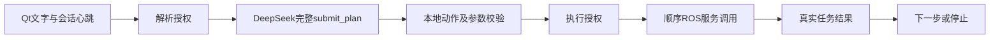

# DeepSeek AI 文本控制

更新：2026-10-07。Qt新增“AI文本控制”页，参考autolabor的完整计划解析、工具白名单、分步派发和真实结果等待，只接入文字输入。

尚未完成ROS/Gazebo或真实DeepSeek联调。本环境本机TCP监听被拒绝；使用私有凭据尝试只读 `/models` 校验返回网络 `ProxyError`，没有验证密钥有效性，没有进行云端控制实验或实际飞行。

## 使用

1. 按README带地图启动，实验使用 `DRONE_SHOW_GAZEBO=0`。
2. 综合页确认初始位姿、地图与定位，启用原有飞行授权。
3. 区域巡检页保存已知区域。AI按当前地图的区域名或ID引用。
4. AI页允许云端解析；仅此项开启时显示完整计划，状态为“仅解析，未执行”。
5. 需要执行时启用“授权AI执行动作”，输入文字并发送，支持Ctrl+Enter。
6. 查看答复、完整步骤、实际结果和异常；停止或撤权中止后续动作，已有降落继续执行。

示例：

- `起飞1米，然后巡检设备区，最后降落。`
- `前往地图坐标(3, 2, 1.2)，然后悬停。`
- `向前移动2米，再向左移动1米。`
- `暂停巡检。`、`继续巡检。`、`取消巡检。`
- `查看当前状态。`

区域名须已保存。地图导航省略Z时保持当前高度；起飞高度是相对高度，省略时使用综合页设置。缺少XY或区域未知时要求补充，不猜测目标。

## 架构与保护



动作包括状态查询、ARM、地面DISARM、相对起飞、降落、HOLD、地图/机体相对点到点、已知区域巡检及暂停/继续/取消。

最多16步；未知动作、额外字段、非有限坐标、过大高度和未知区域拒绝。实际ARM、起飞HOLD、位置/速度到达、巡检终态或落地确认后进入下一步。普通错误停止后续步骤；巡检部分完成可继续后续明确指令，最终标记部分完成。

解析后地图版本改变或区域删除/替换/修改，拒绝旧计划。模型没有shell或参数修改工具。坐标保持ROS ENU，MAVROS负责协议转换。

- AI授权启动时关闭，绑定Qt会话，不从磁盘恢复。
- Qt心跳超过3秒墙钟失效，撤销AI授权。
- 飞行管理器独立检查AI来源；AI导航授权/连接失效时HOLD。AI解锁/起飞失效时停止流程，地面请求DISARM，空中悬停或沿用原保护。
- AI巡检失去授权/连接时独立暂停，可在巡检页人工继续接管。
- 导航按任务ID取消，巡检按计划ID取消，不取消已被其它操作替换的任务。
- AI停止不将降落改为HOLD；各页面均有一键降落。
- AI授权不代替综合页飞行授权，不改变定位、EKF、观测空闲、天花板、避障和OFFBOARD保护。
- 停止不撤销已经完成的动作。地面已完成ARM需锁定时，使用DISARM或撤销AI执行授权。

## 配置和数据

[ai.yaml](../src/drone_stack/config/ai.yaml) 默认使用 `deepseek-flash` Chat Completions接口，关闭思考模式，要求唯一 `submit_plan` 工具计划。接口参考 [DeepSeek官方文档](https://api-docs.deepseek.com/api/create-chat-completion/)。

用户密钥存于本机 `start/private/deepseek.local`，文件600/目录700，Git忽略。环境变量 `DEEPSEEK_API_KEY` 可覆盖文件。密钥不进入ROS参数、源码、文档或任务日志。修改凭据/模型后重启程序。

云端使用文字、飞行状态/位置摘要、UI默认起飞高度、区域名称/ID/高度。区域几何及运动规划在本地处理。日志隐藏形如API密钥的文本，事件保存在 `start/logs/ai/events.jsonl`。

默认网络连接超时5秒、读取30秒；步骤最多300秒仿真时间/900秒墙钟。网络、模型或安全门失败显示在AI页。

| 接口 | 用途 |
|---|---|
| `/drone/ai/set_gate` | 解析/执行授权 |
| `/drone/ai/submit_text` | 异步文字任务 |
| `/drone/ai/cancel` | 停止当前会话 |
| `/drone/ai/client_heartbeat` | Qt会话及默认起飞高度 |
| `/drone/ai/status`、`events` | 状态、计划和事件 |
| `/drone/execute_ai_action` | 受会话门控的飞行动作 |
| `/drone/execute_ai_goal` | 受门控导航，返回任务ID |
| `/drone/cancel_navigation` | 取消匹配任务ID |

## 验证

```bash
source /opt/ros/noetic/setup.bash
catkin_make -j1 -l1 --pkg ego_planner drone_stack
source devel/setup.bash
python3 src/drone_stack/scripts/test_inspection.py
python3 src/drone_stack/scripts/test_inspection_regions.py
python3 src/drone_stack/scripts/test_drone_ai.py
```

完整重启加载新增服务。离线检查覆盖白名单、参数、区域、仅解析、撤权迟到回复、顺序派发、失败停止与取消身份；待在线验证真实API、Qt断连、AI解锁/起飞撤权、连续任务和性能。
